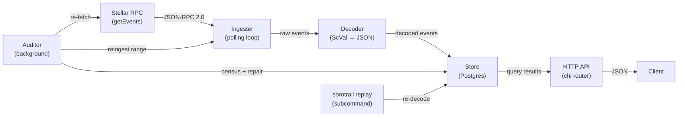

# SoroTrail Architecture

This document describes SoroTrail's internal structure, the data flow from
Stellar RPC to queryable API, and the design decisions that shaped each
component. It is the single place a newcomer should read to understand how
the pieces fit together.

## System overview

SoroTrail is a contract event indexer for the Stellar/Soroban network. It
polls a Stellar RPC endpoint, persists contract events durably in Postgres,
and serves them back through a queryable HTTP API. An optional background
auditor verifies stored data against fresh RPC fetches and auto-repairs
discrepancies.

```
┌─────────────────────────────────────────────────────────────────────┐
│                          sorotrail process                          │
│                                                                     │
│  ┌──────────┐    ┌──────────┐    ┌──────────┐    ┌──────────────┐  │
│  │ Ingester │───▶│ Decoder  │───▶│  Store   │◀───│   HTTP API   │  │
│  └────┬─────┘    └──────────┘    └────┬─────┘    └──────┬───────┘  │
│       │                               │                  │          │
│       │         ┌──────────┐          │                  │          │
│       │         │ Auditor  │──────────┘                  │          │
│       │         └────┬─────┘                             │          │
│       │              │                                   │          │
│       ▼              ▼                                   ▼          │
│  ┌──────────┐    ┌──────────┐                      ┌──────────┐    │
│  │ Stellar  │    │ Budget   │                      │   You    │    │
│  │   RPC    │    │ (rate    │                      │ (client) │    │
│  └──────────┘    │ limiter) │                      └──────────┘    │
│                  └──────────┘                                       │
│                                                                     │
│  ┌──────────┐                                                       │
│  │ Replay   │ (subcommand: sorotrail replay)                        │
│  └──────────┘                                                       │
└─────────────────────────────────────────────────────────────────────┘
```

### Data flow



The ingester polls the RPC at a configurable interval, pages events through
the decoder, and upserts them idempotently into Postgres. The HTTP API
serves stored events over chi. The auditor independently verifies stored
ranges against fresh RPC fetches and repairs mismatches. The replay
subcommand re-runs the decoder over raw XDR to apply decoder improvements
retroactively.

## Components

### `cmd/sorotrail` — entry point

The main binary. With no subcommand it runs the indexer (ingester + HTTP
API + optional auditor). The `replay` subcommand runs decoder replay.

Responsibilities:
- Load and validate configuration (`internal/config`)
- Run Postgres migrations
- Wire all components together via interfaces
- Start the ingester, HTTP API, and (optionally) auditor as concurrent goroutines
- Handle graceful shutdown on SIGINT/SIGTERM

### `internal/config` — configuration

Loads all runtime configuration from environment variables using
`env/v11`. Validates required fields (`DATABASE_URL`), URL formats, numeric
bounds, and contract ID shapes. The configuration struct is the single source
of truth for all tunables.

### `internal/rpc` — Stellar RPC client

A minimal JSON-RPC 2.0 client that wraps three methods the system needs:
`getEvents`, `getLatestLedger`, and `getHealth`. The client is defined as
an interface (`rpc.Client`) so the ingester, auditor, and API can be tested
with mocks.

Key behaviors:
- **Rate limiting**: requests are spaced ≥100ms apart by default (~10 req/s)
  to stay within public endpoint limits.
- **XDR format fallback**: the client initially requests `xdrFormat: "json"`
  for readable ScVal output; if the server rejects it (older nodes), it
  falls back to base64 XDR and decodes locally.
- **Budget splitting**: when the auditor is enabled, `rpc.Budget` splits the
  total request rate between the ingest pool and the audit pool via two
  independent token-bucket limiters.

### `internal/decode` — ScVal decoder

Converts Soroban ScVal payloads (base64 XDR or server-decoded JSON) into
queryable JSON objects. The `Decoder` interface is intentionally thin — a
single `DecodeScVal(base64XDR) → json.RawMessage` method.

The `XDRDecoder` implementation handles all ScVal types via a type switch in
`scValToGo`. Unhandled types fall through to a lossless
`{"unknown": {"type": ..., "base64": ...}}` wrapper, so ingestion never
stalls on exotic values.

The `EventTopicsValue` function orchestrates decoding for a complete event:
it prefers the RPC's own JSON fields (`topicJson`/`valueJson`) when
available and falls back to local XDR decoding.

### `internal/store` — persistence layer

Defines the `Store` interface — the persistence boundary that the ingester,
auditor, and API depend on, never Postgres directly. This abstraction
enables alternative storage backends without changing any consumer.

#### `store.Store` interface

| Method | Purpose |
|--------|---------|
| `UpsertEvents` | Idempotent insert (duplicates ignored); used by ingest |
| `ReplaceEventsInRange` | Atomic delete-orphan + insert-or-update; used by auditor repair |
| `GetEvent` | Single-event lookup by ID |
| `QueryEvents` | Paginated query with filter, cursor, and sort support |
| `LedgerRangeCensus` | Per-ledger event counts (and optionally IDs) for audit |
| `GetIngestionState` / `SaveIngestionState` | Persist the ingester's resume position |
| `GetAuditState` / `SaveAuditState` / `SaveAuditStateIfGreater` | Persist and advance the auditor's verified-through high-water mark |
| `ListWatchedContracts` / `AddWatchedContract` | Manage the watch list |
| `RecordAuditFinding` / `UpdateAuditFinding` / `ListOpenFindingsByRange` | Audit finding lifecycle |
| `Stats` | Aggregate statistics for `/stats` |
| `Ping` | Dependency health check |

#### Postgres backend (`store.Postgres`)

The only backend implemented today. Uses `pgx` (plain SQL, no ORM) with a
connection pool. Schema changes are managed via numbered migration pairs in
`internal/store/migrations/`.

**Schema highlights:**

| Table | Purpose |
|-------|---------|
| `events` | Contract events with decoded topics/value (JSONB), raw XDR columns, and indexes on `contract_id`, `ledger`, `created_at`, and a GIN index on `topics` |
| `ingestion_state` | Singleton row tracking the ingester's last ingested ledger and pagination cursor |
| `watched_contracts` | Contract IDs the operator wants to track |
| `audit_state` | Singleton row tracking the auditor's verified-through high-water mark |
| `audit_findings` | One row per discrepancy the auditor discovered, with status lifecycle |
| `replay_state` | Singleton row tracking the replay tool's progress |

#### `internal/replay` — decoder replay tool

Not part of the `Store` interface (so backends that don't need replay
aren't forced to implement it). Re-runs the current decoder pipeline over
stored raw XDR and rewrites the decoded columns in place.

Key properties:
- **Pure function of raw XDR**: nothing reads existing decoded columns
- **Batched and resumable**: each batch commits progress in the same
  transaction as its rewrites; Ctrl-C resumes on re-run
- **Idempotent**: running twice is a no-op
- **Live-safe**: short transactions, no table-level locks, no ingestion disruption
- **Advisory-locked**: only one replay at a time via `pg_try_advisory_lock`

### `internal/ingester` — polling loop

Runs the core ingestion loop: resolve resume position, fetch events from
the RPC, decode them, upsert into Postgres, persist state, repeat.

**Position resolution:**
1. If a saved pagination cursor exists → resume mid-page
2. If `LastIngestedLedger > 0` → warm start (ledger + 1)
3. Otherwise → cold start (`latest - RETENTION_LEDGERS`, clamped to RPC's
   oldest retained ledger)

**Filter batching:** The RPC caps filters at 5 per request and 5 contract
IDs per filter (max 25 watched contracts per request chain). With more
watched contracts, the ingester splits into multiple filter batches and
sweeps a bounded ledger window, each batch paging to completion in memory.

**Error handling:** Jittered exponential backoff on failures; the only
terminal condition is context cancellation. If the resume point falls outside
the RPC's retention window, the ingester logs a warning and skips ahead —
the gap is unrecoverable, which is the very problem SoroTrail exists to
prevent.

### `internal/audit` — background verifier

Walks recently-ingested ledger ranges (behind the ingest frontier, inside
the RPC's retention window) and re-fetches each range with the ingester's
exact filter configuration, comparing stored event counts and IDs against
the fresh response.

**Finding lifecycle:**
```
open ──▶ repaired (RPC agrees after repair)
  │
  ├──▶ unverifiable (range aged out of RPC retention)
  │
  └──▶ unrecoverable (RPC self-disagreement after max attempts)
```

**Budget management:** The auditor shares the total RPC request rate with
the ingester via `rpc.Budget`. By default, the audit pool gets 10% of the
budget and the ingest pool gets 90%.

**Lag pause:** The auditor sleeps until ingestion has moved at least
`AUDIT_LAG_THRESHOLD` ledgers past `verified_through_ledger`, so it never
races the ingester.

### `internal/api` — HTTP API

A chi-based HTTP server exposing the stored events. Read-only by design;
any write endpoints (e.g. managing watched contracts at runtime) should
come with authentication first.

**Endpoints:**

| Route | Purpose |
|-------|---------|
| `GET /health` | Checks database and RPC reachability |
| `GET /events` | Paginated event listing with filter support |
| `GET /events/{id}` | Single event by ID |
| `GET /contracts/{id}/events` | Convenience wrapper for contract-scoped queries |
| `GET /stats` | Aggregate counts and auditor metrics |

The API depends only on `store.Store` and `rpc.Client` (for `/health`),
never on concrete implementations.

## Key design decisions

### Why events are partitioned by ledger

Stellar's RPC returns events keyed by ledger sequence, and ledger order is
the natural chronological order for the chain. Partitioning by ledger
enables:

- **Efficient range scans**: the `idx_events_ledger` index supports fast
  `BETWEEN` queries for time-range and ledger-range filters.
- **Audit reconciliation**: the auditor compares per-ledger event counts
  between the store and a fresh RPC fetch. Ledger-level granularity makes
  mismatches tractable — a single finding is bounded to a small window.
- **Idempotent upserts**: events are deduplicated by their RPC-assigned
  TOID-based ID, which encodes ledger sequence. Re-scans after crashes
  never create duplicates.
- **Retention window alignment**: the RPC's own retention is expressed in
  ledgers, so the ingester's cold-start reach-back and the auditor's
  verification window map directly to ledger ranges.

### Why the cursor model works the way it does

SoroTrail uses two kinds of cursors for two different purposes:

1. **Ingestion cursor** (`ingestion_state.last_cursor`): an opaque
   pagination token from the RPC's `getEvents` response. When set, the
   ingester resumes mid-page without specifying a `startLedger` (the RPC
   rejects requests that carry both). This is critical for large backfills
   where a single page takes many seconds — each page commits durable
   progress so even a crash loses at most one page of work.

2. **Query cursor** (`/events?cursor=`): the TOID-based event ID from the
   last event in a page. Because TOIDs are zero-padded, their
   lexicographic order matches chronological order, so `id > cursor` walks
   events forward (or `id < cursor` for descending). This gives stable,
   keyset-based pagination that doesn't degrade with offset size.

The ingestion cursor is preferred over re-scanning from `latest + 1`
because `startLedger` must stay within the RPC's retained range, and
`latest + 1` is always rejected. Only when no cursor is available (empty
page, old server) does the ingester fall back to ledger-based resumption —
idempotent upserts make the one-ledger overlap harmless.

### Why Scope fails closed

Several boundaries in SoroTrail are designed to fail closed — that is,
when something goes wrong, the system conservatively refuses to serve or
ingest rather than silently producing incorrect results:

- **Ledger out of range**: if the RPC reports the requested `startLedger`
  is outside its retention window, the ingester skips ahead rather than
  serving stale or partial data. The gap is logged as a warning.

- **Audit findings**: when the auditor cannot determine whether stored
  data is correct (e.g. the RPC returns inconsistent results across
  fetches, or the range has aged out of retention), the finding stays
  visible with a terminal status (`unrecoverable` or `unverifiable`)
  rather than being silently cleared. Operators see it via `/stats`.

- **Decoder fallback**: unknown ScVal types produce a lossless
  `{"unknown": {...}}` wrapper instead of erroring, so ingestion never
  stalls — but the data is clearly marked as not fully decoded.

- **Health endpoint**: `/health` returns `503` if either the database or
  RPC is unreachable, so load balancers and operators get an honest signal.

- **Replay locking**: a session-level Postgres advisory lock prevents two
  replays from running concurrently. The `try` lock fails immediately
  rather than queueing, so a second replay surfaces the conflict instead
  of silently interleaving writes.

## Store abstraction and backends

The `store.Store` interface is the persistence boundary. It is designed so
that each method is independently testable and replaceable:

- **Postgres** (`store.Postgres`): the only backend implemented today.
  Uses `pgx` with plain SQL. Migrations are numbered pairs in
  `internal/store/migrations/`.

- **Alternative backends**: the interface is intentionally minimal. A
  contributor can implement `Store` for SQLite, DynamoDB, or any other
  persistence layer. The contract requires `QueryEvents` to return events
  in ascending ID order for cursor pagination to work.

Replay-specific persistence (`store.ReplayLock`, `GetReplayState`, etc.) is
deliberately **not** part of the `Store` interface. It lives on
`*store.Postgres` and is consumed through the narrower `replay.Store`
interface, so backends that don't need the maintenance replay tool aren't
forced to implement one.

## What's implemented today

| Component | Status |
|-----------|--------|
| Stellar RPC client | ✅ Complete — `getEvents`, `getLatestLedger`, `getHealth` |
| XDR decoder | ✅ Complete — all ScVal types handled, lossless fallback |
| Postgres store | ✅ Complete — full `Store` interface implemented |
| Ingester | ✅ Complete — cold/warm start, filter batching, backoff |
| HTTP API | ✅ Complete — events, health, stats, contract queries |
| Auditor | ✅ Complete — verification, auto-repair, finding lifecycle |
| Replay tool | ✅ Complete — batched, resumable, idempotent, advisory-locked |
| Rate limiting / budget | ✅ Complete — shared budget between ingest and audit |

## What's aspirational (not yet implemented)

The following are mentioned in the README roadmap or CONTRIBUTING.md but
do **not** exist in the codebase yet:

- **Per-standard event decoders** (e.g. SEP-41 token transfers) on top of
  `decode.Decoder`. The `Decoder` interface and `ReplayBatch` extension
  point are ready, but no standard-specific decoder is implemented.
- **More than 25 watched contracts** with smarter scheduling (parallel
  sweeps, per-contract cursors). The windowed sweep handles this today
  but sequentially.
- **GraphQL / WebSocket subscriptions** for real-time event streaming.
- **Metrics (Prometheus) and tracing** for production observability.
- **Alternative storage backends** behind `store.Store`.
- **Runtime watched-contract management** via the API (would require
  authentication).

## Package dependency graph

```
cmd/sorotrail
  ├── internal/config
  ├── internal/store
  ├── internal/rpc
  ├── internal/decode
  ├── internal/ingester
  │     ├── internal/rpc      (rpc.Client)
  │     ├── internal/store    (store.Store)
  │     └── internal/decode   (decode.Decoder)
  ├── internal/api
  │     ├── internal/store    (store.Store)
  │     ├── internal/rpc      (rpc.Client)
  │     └── internal/audit    (for /stats)
  └── internal/audit
        ├── internal/rpc      (rpc.Client)
        ├── internal/store    (store.Store)
        └── internal/ingester (Reingester interface)

internal/replay
  ├── internal/decode         (decode.Decoder)
  └── internal/store          (replay.Store — narrower than store.Store)
```

No circular dependencies. Each package depends only on interfaces from its
neighbors, so the whole graph is independently testable.
